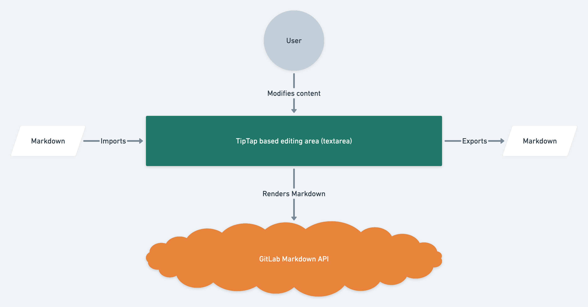

# Content Editor **(FREE)**

The Content Editor is a UI component that provides a WYSIWYG editing
experience for [GitLab Flavored Markdown](https://docs.gitlab.com/ee/user/markdown.md#gitlab-flavored-markdown-gfm) (GFM) in the GitLab application.
It also serves as the foundation for implementing Markdown-focused editors
that target other engines, like static site generators.

We use [tiptap 2.0](https://www.tiptap.dev/) and [prosemirror](https://prosemirror.net/)
to build the Content Editor. These frameworks provide a level of abstraction on top of
the native [contenteditable](https://developer.mozilla.org/en-US/docs/Web/Guide/HTML/Editable_content) web technology.

## Architecture remarks

From a high level point of view, the Content Editor imports arbitrary Markdown, renders
it in a HTML editing area, and exports it back to Markdown with changes introduced
by the user. The Content Editor relies on the
[Markdown API endpoint](https://docs.gitlab.com/ee/api/markdown.html) to transform Markdown
into HTML. It sends the Markdown input to the REST API and displays the API’s
HTML output in the editing area. The editor exports the content back to Markdown
 using a client-side library that serializes editable documents into Markdown.



Check the [Content Editor technical design document](https://docs.google.com/document/d/1fKOiWpdHned4KOLVOOFYVvX1euEjMP5rTntUhpapdBg)
for more information about the design decisions that drive the development of the editor.

**NOTE**: We also designed the Content Editor to be extensible. We will provide
more information about extension development for supporting new types of content in upcoming
milestones.

## GitLab Flavored Markdown support

The [GitLab Flavored Markdown (GFM)](https://docs.gitlab.com/ee/user/markdown.html) extends
the [Commonmark specification](https://spec.commonmark.org/0.29/) with support for a
variety of content types like diagrams, math expressions, and tables. Supporting
all GFM content types in the Content Editor is a work in progress. Check the
[Basic Markdown formatting extensions](https://gitlab.com/groups/gitlab-org/-/epics/5404)
and the [GitLab Flavored Markdown extensions](https://gitlab.com/groups/gitlab-org/-/epics/5438)
epics to see the status of the ongoing development for Commonmark and GFM support.

## Usage

To include the Content Editor in your feature, import the `createContentEditor` factory
function and the `ContentEditor` Vue component. `createContentEditor` sets up an instance
of [tiptap’s Editor class](https://www.tiptap.dev/api/editor) with all the necessary
extensions to support editing GitLab Flavored Markdown content. It also creates
a Markdown serializer that allows exporting tiptap’s document format to Markdown.

`createContentEditor` requires a `renderMarkdown` parameter that will be invoked
by the editor every time it needs to convert Markdown to HTML. The Content Editor
does not provide a default value for this function yet.

**NOTE**: The Content Editor is in an early development stage. Usage and development
guidelines are subject to breaking changes in the upcoming months.

```html
<script>
import { GlButton } from '@gitlab/ui';
import { createContentEditor, ContentEditor } from '~/content_editor';
import { __ } from '~/locale';
import createFlash from '~/flash';

export default {
  components: {
    ContentEditor,
    GlButton,
  },
  data() {
    return {
      contentEditor: null,
    }
  },
  created() {
    this.contentEditor = createContentEditor({
      renderMarkdown: (markdown) => Api.markdown({ text: markdown }),
    });

    try {
      await this.contentEditor.setSerializedContent(this.content);
    } catch (e) {
      createFlash(__('There was an error loading content in the editor'), e);
    }
  },
  methods: {
    async save() {
      await Api.updateContent({
        content: this.contentEditor.getSerializedContent(),
      });
    },
  },
};
</script>
<template>
  <div>
    <content-editor :content-editor="contentEditor" />
    <gl-button @click="save()">Save</gl-button>
  </div>
</template>
```

Call `setSerializedContent` to set initial Markdown in the Editor. This method is
asynchronous because it makes an API request to render the Markdown input.
`getSerializedContent` returns a Markdown string that represents the serialized
version of the editable document.
