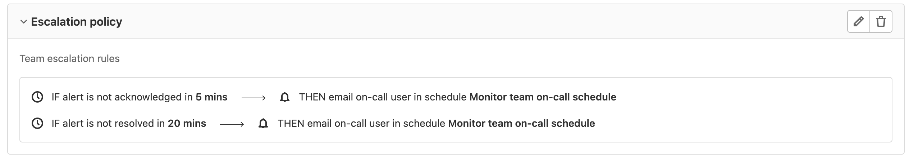

# Escalation Policies **(PREMIUM)**

> [Introduced](https://gitlab.com/groups/gitlab-org/-/epics/4638) in [GitLab Premium](https://about.gitlab.com/pricing/) 14.0.

Escalation Policies contain time-boxed steps that will automatically page a responder in the next escalation step if the responder in the previous step has not responded. To protect your company from missed critical alerts, create an escalation policy in the GitLab project where you manage [On-call schedules](./oncall_schedules.md).

## Add an escalation policy

If you have at least Maintainer [permissions](../../user/permissions.md) you can create an escalation policy. Follow these steps:

1. Go to **Operations > Escalation Policies** and select **Add an escalation policy**.
1. In the **Add escalation policy** form, enter the policy's name, description, and create escalation rules that will be followed when an alert is missed by a primary responder.
1. Click **Add escalation policy**.

### Edit an escalation policy

Follow these steps to update an escalation policy:

1. Go to **Operations > Escalation Policies**  and select the **Pencil** icon on the top right of the
   policy card, across from the policy name.
1. In the **Edit policy** form, edit the information you wish to update.
1. Click the **Edit policy** button to save your changes.

### Delete an escalation policy

Follow these steps to delete a policy:

1. Go to **Operations > Escalation Policies**  and select the **Trash Can** icon on the top right of the
   policy card.
1. In the **Delete policy** window, click the **Delete** button.
