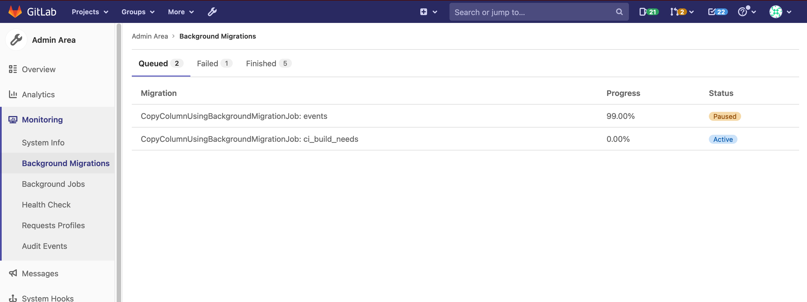

# Background Migrations **(FREE SELF)**

> - [Introduced](https://gitlab.com/gitlab-org/gitlab/-/issues/326760) in GitLab 13.12.

This page shows the status of background migrations for the current GitLab instance. All migrations
need to be finished before upgrading GitLab.

