# How to create HAR files

DANGER: **Warning:**
HAR files may contain sensitive information such as authentication tokens, API keys, and session cookies. We recommend that you review the HAR file contents before adding them to a repository.

## Creating HAR files

1. [GitLab HAR Recorder](#gitLab-har-recorder)
1. [Insomnia API Client](#insomnia-api-client)
1. [Safari](#safari)
1. [Chrome](#chrome)
1. [Fiddler debugging proxy](#fiddler-debugging-proxy)

### GitLab HAR Recorder

1. Install Python 3.6 or greater.
1. Install HAR Recorder.
1. Start recorder w/proxy port + har filename.
1. Run things using proxy.
   1. Make sure proxy is used!
1. Stop recorder.
1. Done!
1. [HAR Viewer (online)](http://www.softwareishard.com/har/viewer/) can be used to verify HAR has all requests.

### Insomnia API Client

1. Define or import your API.
   1. Postman v2.
   1. Curl.
   1. OpenAPI v2, v3.
1. Make sure each API call works.
   1. If you imported an OpenAPI specification, go through and add working data.
1. Workspace carrot -> Import/export.

   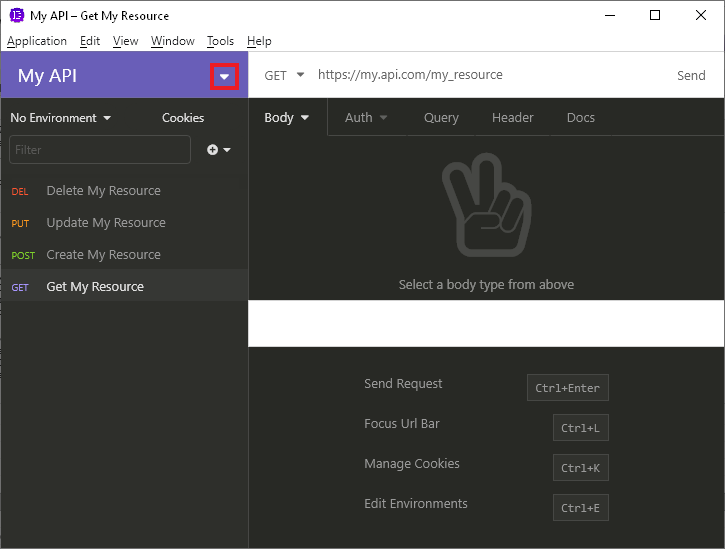
   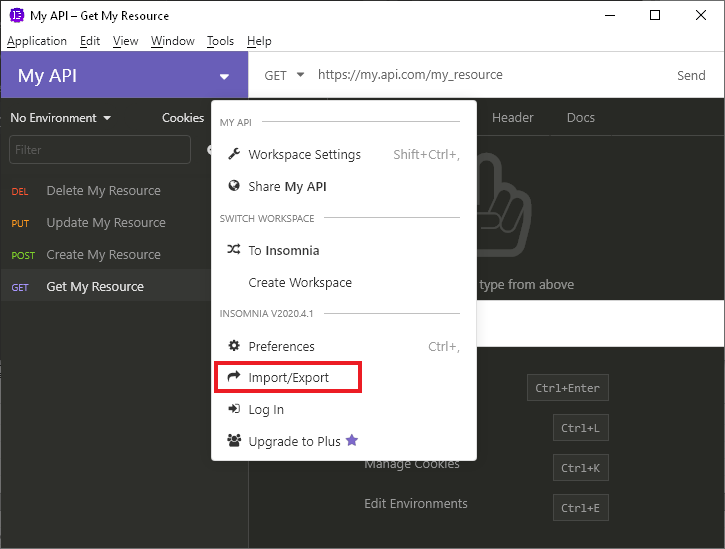

1. Export Data carrot -> Current Workspace.

   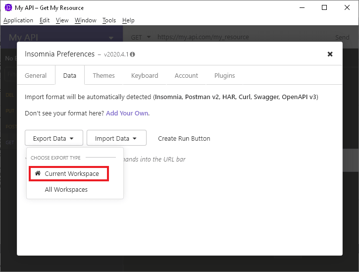

1. Select requests to include in HAR.

   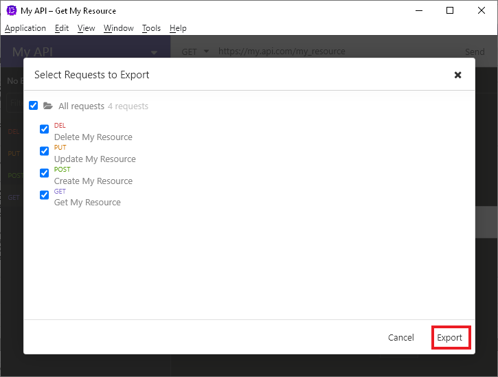

1. Click Export.
1. Select `HAR -- HTTP Archive Format` from dropdown.

   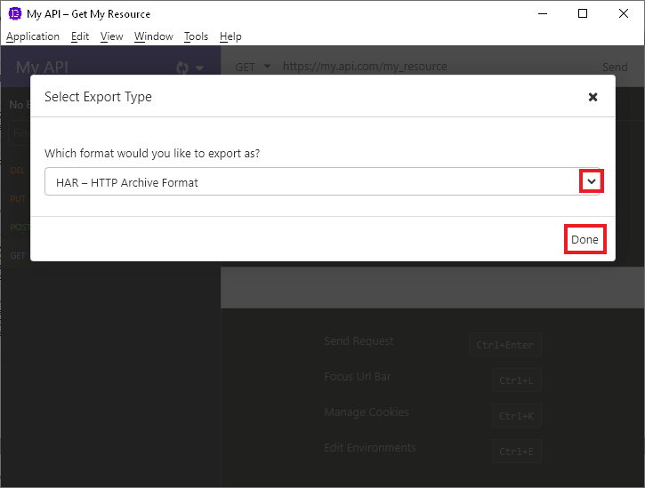

1. Click Done.
1. Select location and filename for har file.

### Safari

Safari will require you to enable `Develop menu` before being able to export HAR files.

1. Make sure `Develop menu` is enable.
   1. Open Safari Preferences by pression `Command` + `,` or using menu `Safari / Preferences...`
   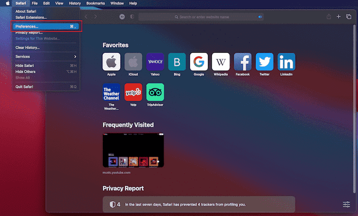

   1. Select `Advanced` tab, and check `Show Develop menu item in menu bar`
   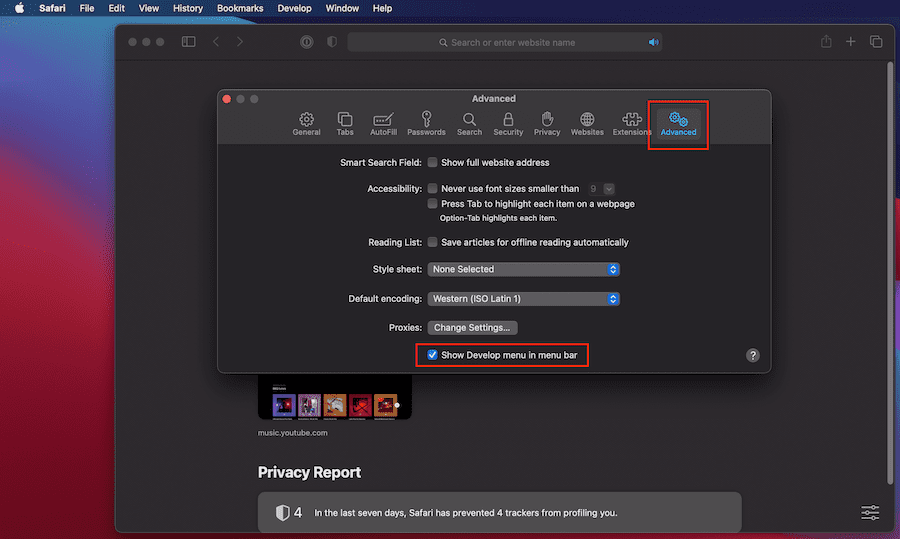

   1. Close `Preferences` window
1. Open `Web Inspector` by pressing `Option` + `Command` + `i`, or by selecting menu `Develop / Show Web Inspector`
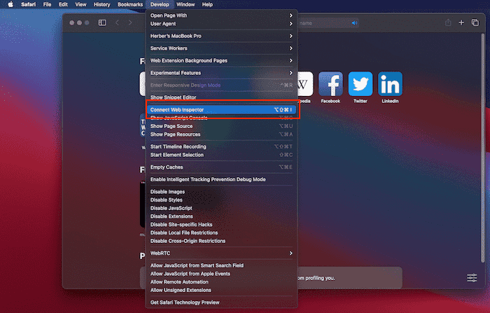

1. Select `Network` tab pane, and check `Preserve Log`
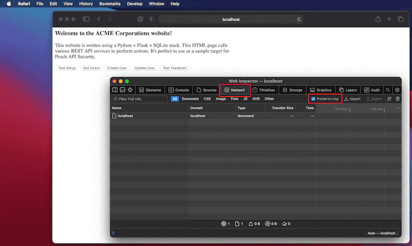

1. Browse pages that call API.  
1. In `Web Inspector` window in `Network` tab and select the request to export.
1. Export the request by using right click on the request or by clicking on the `Export` buton.

1. Profile filename and hit `Save`.
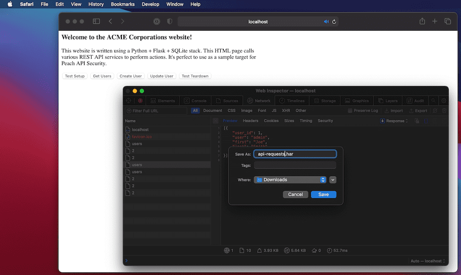

### Chrome

1. Right click Inspect.
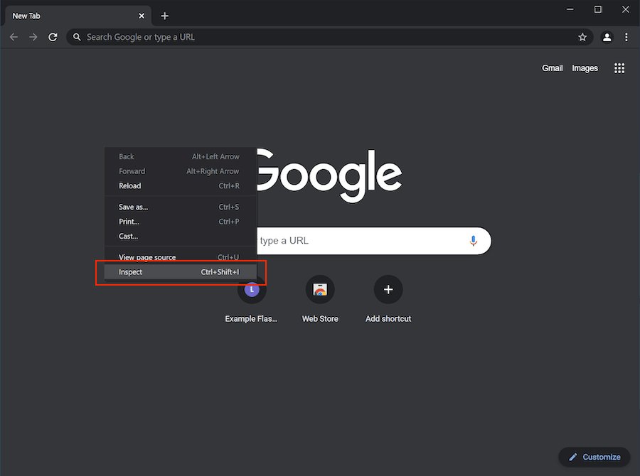

1. Network tab.
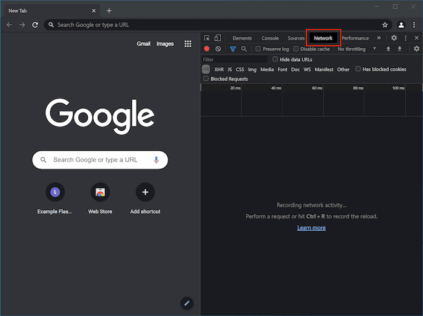

1. Check `Preserve log`.
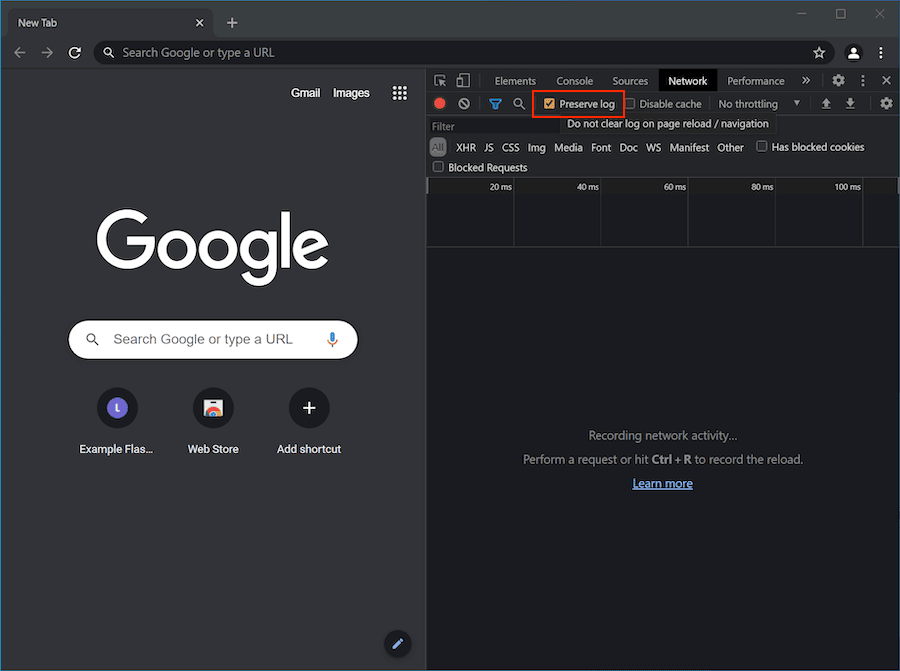

1. Browse pages that call API.
1. Select one or more requests.
1. Right click `Save all as HAR with content`.
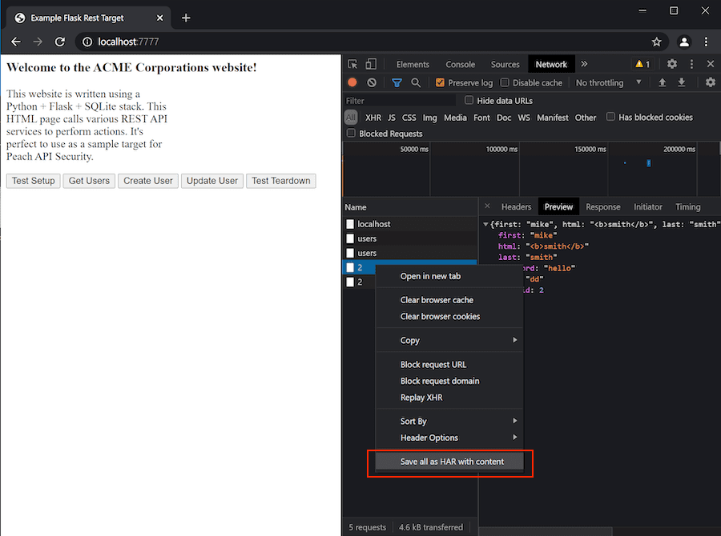

1. Profile filename and hit `Save`.
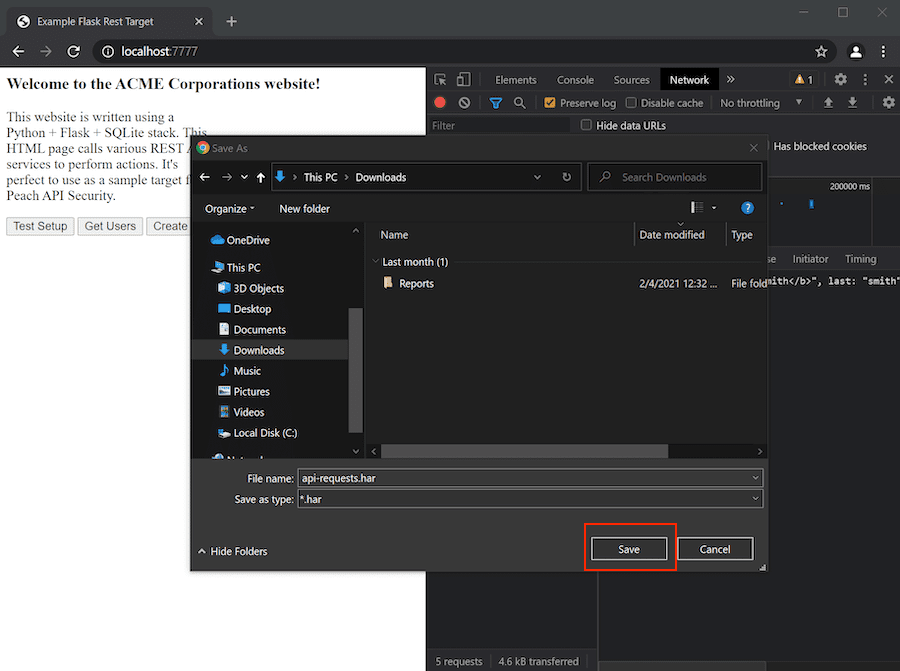

1. Repeat using same filename to append additional requests.

### Fiddler debugging proxy

1. Star Fiddler (latest version of Fiddler will require to create an account).
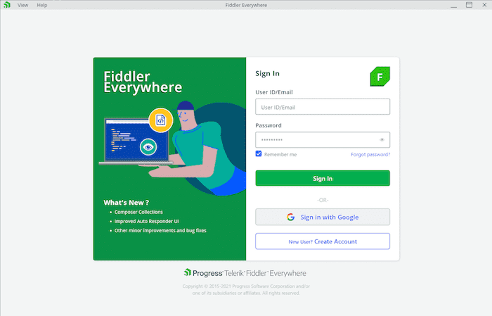

1. Browse pages that call API. Fiddler automatically will capture requests.
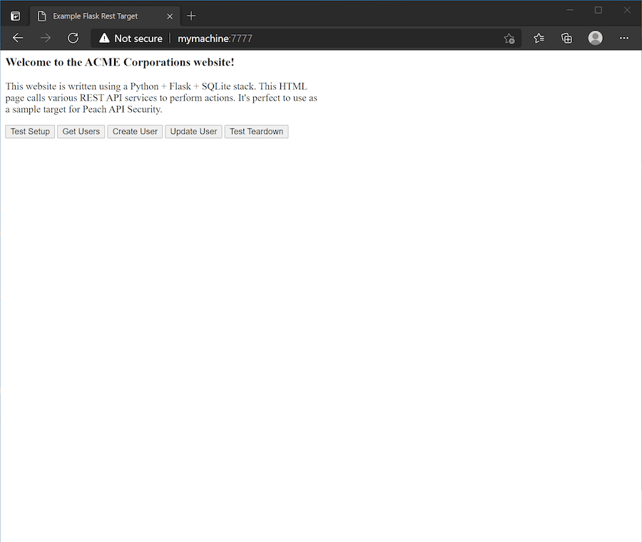

1. Select one or more requests.
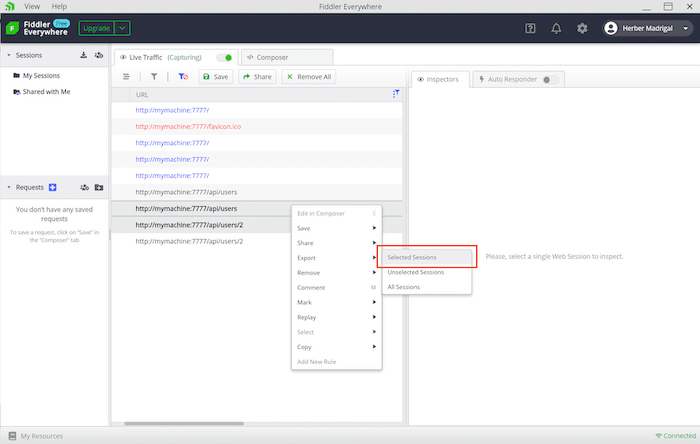

1. Select the format `HTTPArchive v1.2`.
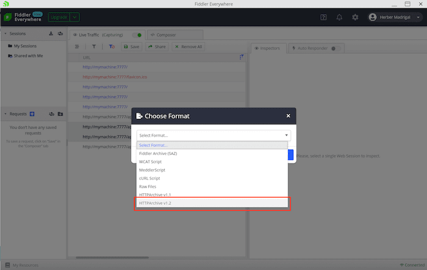

1. Profile filename and hit `Save`.
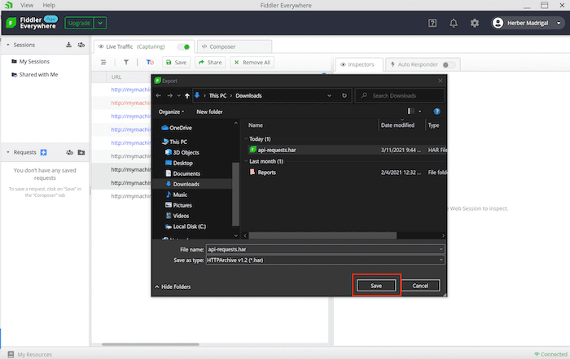

1. Fiddler will confirm once the export has succedded.
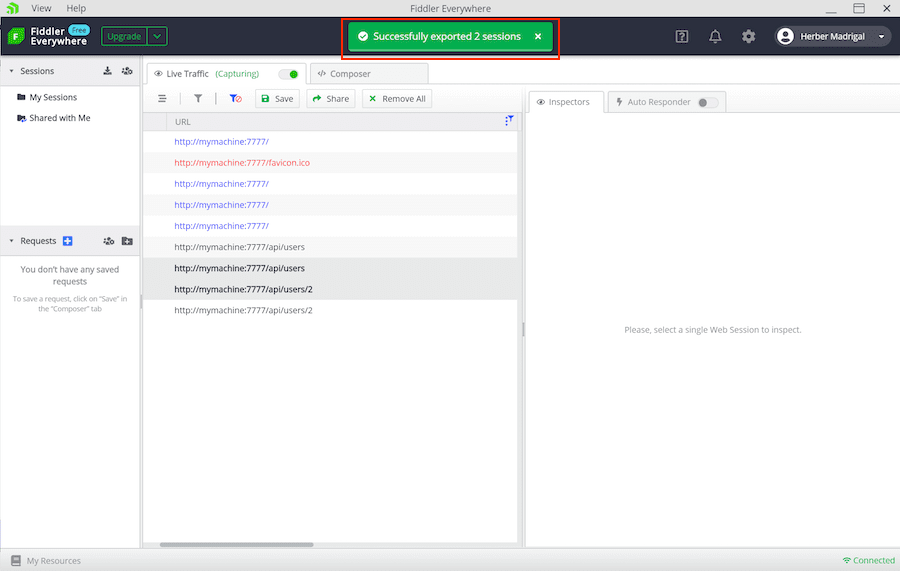
