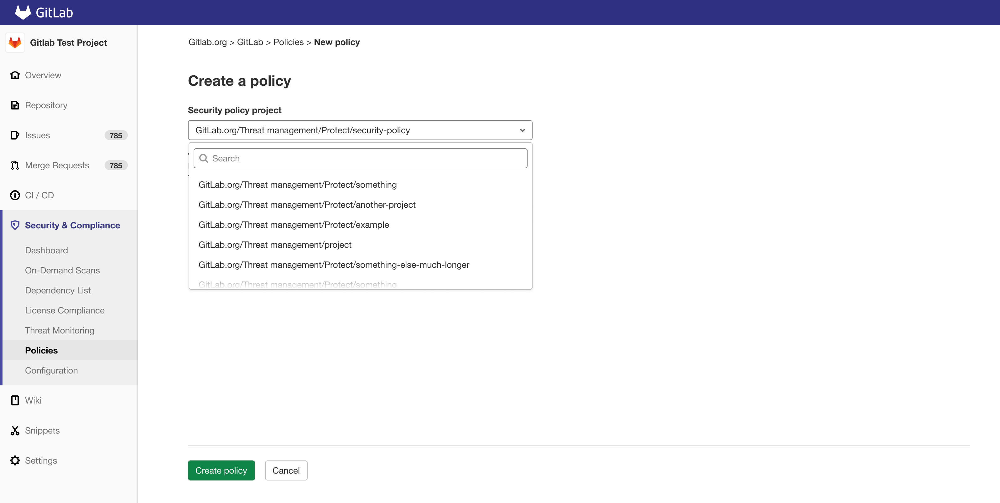
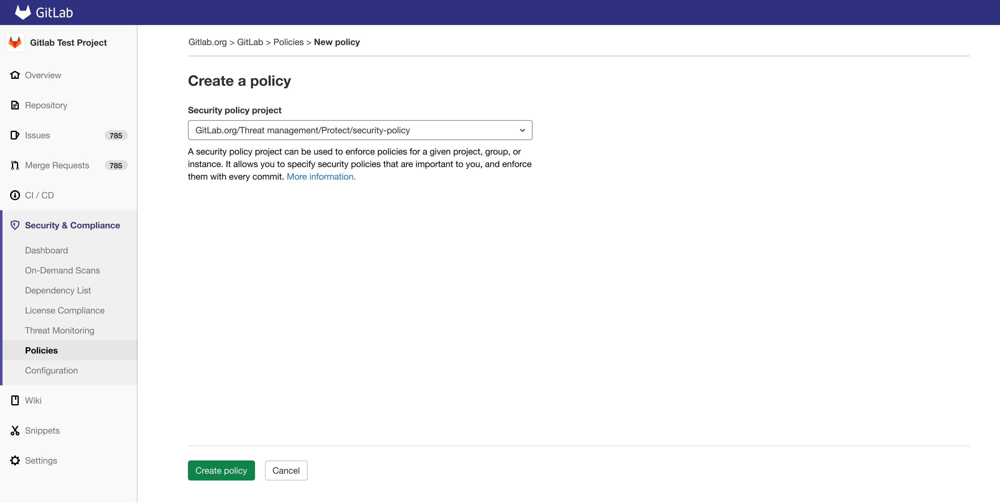

# Security Policies **(ULTIMATE)**

> [Introduced](https://gitlab.com/groups/gitlab-org/-/epics/5329) in [GitLab Ultimate](https://about.gitlab.com/pricing/) 13.10.

The **Security Policies** page provides policy management
for the GitLab application security features. You can access
these by navigating to your project's **Security & Compliance > Policies** page.

GitLab supports the following security policies:

- [Scan Execution Policy](#scan-execution-policy-schema)

## Important notes

Note the following:

- We recommend using the security orchestration policy project exclusively for managing policies for the project.
  Do not add your application's source code to such projects.

## Security Orchestration Policy Project

The **Security Policies** feature is a repository to store policies. All policies are stored in `.gitlab/security-policies`
directory. All security policies are stored in the directory above as a YAML file with given format:

```yaml
---
type: scan_execution_policy
name: Enforce DAST in every pipeline
description: This policy enforces pipeline configuration to have a job with DAST scan
enabled: true
rules:
- type: pipeline
  branch: master
actions:
- scan: dast
  scanner_profile: Scanner Profile A
  site_profile: Site Profile B
```

## Security Orchestration Policy Schemas

### Scan Execution Policy Schema

| Field | Type | Possible values | Description |
|-|-|-|-|
| `type` | `string` | `scan_execution_policy` | Specifies the type of the policy |
| `name` | `string` |  | Name of the policy |
| `description` (optional) | `string` |  | Description of the policy |
| `enabled` | `boolean` | `true`/`false` | Flag to enable or disable the policy |
| `rules` | `array` of [`Rule`](#security-orchestration-policy-schema---rules) |  | List of rules for which policy will be applicable |
| `actions` | `array` of [`Action`](#security-orchestration-policy-schema---actions) |  | List of actions that will be enforced by policy |

#### Security Orchestration Policy Schema - Rules

##### `pipeline` rule type

This rule will enforce defined actions whenever the pipeline is run for a selected branch.

| Field | Type | Possible values | Description |
|-|-|-|-|
| `type` | `string` | `pipeline` | Specifies the type of the rule |
| `branch` | `string` | `*` or name of the branch | Specifies on which branch given policy will be applicable (supports wildcard) |

#### Security Orchestration Policy Schema - Actions

##### `scan` action type

This action will execute selected `scan` with additional parameters when conditions for at least one rule in defined policy are met

| Field | Type | Possible values | Description |
|-|-|-|-|
| `scan` | `string` | `dast` | Specifies the type of the action |
| `site_profile` | `string` | name of the selected [DAST Site Profile](../dast/index.md#site-profile) | Specifies which [DAST Site Profile](../dast/index.md#site-profile) should be used to execute DAST scan  |
| `scanner_profile` | `string` or `null` | name of the selected [DAST Scanner Profile](../dast/index.md#scanner-profile) | Specifies which [DAST Scanner Profile](../dast/index.md#scanner-profile) should be used to execute DAST scan  |

Note the following:

- You need to create [Site Profile](../dast/index.md#site-profile) and [Scanner Profile](../dast/index.md#scanner-profile) with selected names for the project that is assigned to the selected Security Orchestration Policy Project,
  otherwise the policy will not be applied and job with an error message will be created instead.
- Once you associate [Site Profile](../dast/index.md#site-profile) and [Scanner Profile](../dast/index.md#scanner-profile) by name in the policy,
  it will not be possible to modify or delete them. If you want to modify them, you need to first disable the policy by setting the `active` flag to `false`.

#### Example

```yaml
---
type: scan_execution_policy
name: Enforce DAST in every pipeline
description: This policy enforces pipeline configuration to have a job with DAST scan
enabled: true
rules:
- type: pipeline
  branch: release/*
actions:
- scan: dast
  scanner_profile: Scanner Profile A
  site_profile: Site Profile B
```

When the policy is defined like above we will enforce running DAST scan with `Scanner Profile` with the name `Scanner Profile A`
and `Site Profile` with name `Site Profile B` for every pipeline executed for branches which name is matched against `release/*`
wildcard (ie. `release/v1.2.1`).

## Security Orchestration Policy Project Selection

When the Security Orchestration Policy Project is created and policies are created within that repository you need to create
association between that project and the project you want to apply policies to.

You can do that by navigating to your project's **Security & Compliance > Policies** and selecting **Security policy project**
from the dropdown menu and then clicking on **Create policy** button to save changes.



You can always change the **Security policy project** by navigating to your project's **Security & Compliance > Policies**
and modifying the selected project.



### Disable or enable Security Orchestration Policy

Security Orchestration Policy is deployed behind a feature flag that is **disabled by default**.
[GitLab administrators with access to the GitLab Rails console](../../../administration/feature_flags.md)
can opt to enable it.

To enable it:

```ruby
Feature.enable(:security_orchestration_policies_configuration)
```

To disable it:

```ruby
Feature.disable(:security_orchestration_policies_configuration)
```
