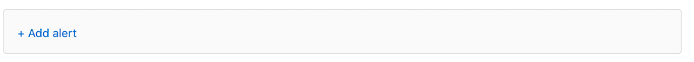
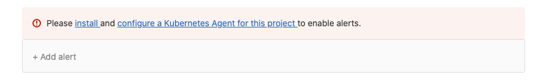
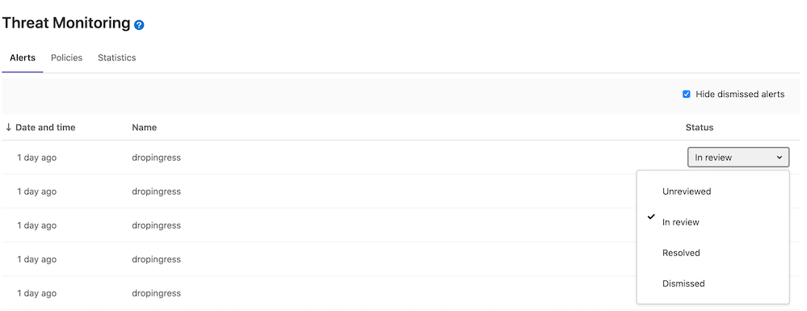
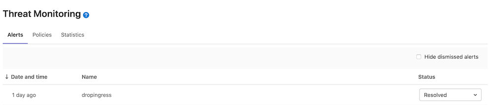
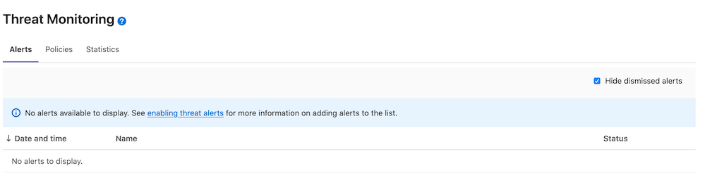

# Threat Monitoring **(ULTIMATE)**

> [Introduced](https://gitlab.com/gitlab-org/gitlab/-/issues/14707) in [GitLab Ultimate](https://about.gitlab.com/pricing/) 12.9.

The **Threat Monitoring** page provides metrics and policy management
for the GitLab application runtime security features. You can access
these by navigating to your project's **Security & Compliance > Threat
Monitoring** page.

GitLab supports statistics for the following security features:

- [Web Application Firewall](../../clusters/applications.md#web-application-firewall-modsecurity)
- [Container Network Policies](../../../topics/autodevops/stages.md#network-policy)

## Web Application Firewall

The Web Application Firewall section provides metrics for the NGINX
Ingress controller and ModSecurity firewall. This section has the
following prerequisites:

- Project has to have at least one [environment](../../../ci/environments/index.md).
- [Web Application Firewall](../../clusters/applications.md#web-application-firewall-modsecurity) has to be enabled.
- [Elastic Stack](../../clusters/applications.md#web-application-firewall-modsecurity) has to be installed.

If you are using custom Helm values for the Elastic Stack you have to
configure Filebeat similarly to the [vendored values](https://gitlab.com/gitlab-org/gitlab/-/blob/f610a080b1ccc106270f588a50cb3c07c08bdd5a/vendor/elastic_stack/values.yaml).

The **Web Application Firewall** section displays the following information
about your Ingress traffic:

- The total amount of requests to your application
- The proportion of traffic that is considered anomalous according to
  the configured rules
- The request breakdown graph for the selected time interval

If a significant percentage of traffic is anomalous, you should
investigate it for potential threats by
[examining the Web Application Firewall logs](../../clusters/applications.md#web-application-firewall-modsecurity).

## Container Network Policy

> [Introduced](https://gitlab.com/gitlab-org/gitlab/-/issues/32365) in [GitLab Ultimate](https://about.gitlab.com/pricing/) 12.9.

The **Container Network Policy** section provides packet flow metrics for
your application's Kubernetes namespace. This section has the following
prerequisites:

- Your project contains at least one [environment](../../../ci/environments/index.md)
- You've [installed Cilium](../../clusters/applications.md#install-cilium-using-gitlab-cicd)
- You've configured the [Prometheus service](../../project/integrations/prometheus.md#enabling-prometheus-integration)

If you're using custom Helm values for Cilium, you must enable Hubble
with flow metrics for each namespace by adding the following lines to
your [Cilium values](../../clusters/applications.md#install-cilium-using-gitlab-cicd):

```yaml
global:
  hubble:
    enabled: true
    metrics:
      enabled:
        - 'flow:sourceContext=namespace;destinationContext=namespace'
```

The **Container Network Policy** section displays the following information
about your packet flow:

- The total amount of the inbound and outbound packets
- The proportion of packets dropped according to the configured
  policies
- The per-second average rate of the forwarded and dropped packets
  accumulated over time window for the requested time interval

If a significant percentage of packets is dropped, you should
investigate it for potential threats by
[examining the Cilium logs](../../clusters/applications.md#install-cilium-using-gitlab-cicd).

## Container Network Policy management

> [Introduced](https://gitlab.com/groups/gitlab-org/-/epics/3328) in [GitLab Ultimate](https://about.gitlab.com/pricing/) 13.1.

The **Threat Monitoring** page's **Policy** tab displays deployed
network policies for all available environments. You can check a
network policy's `yaml` manifest, toggle the policy's enforcement
status, and create and edit deployed policies. This section has the
following prerequisites:

- Your project contains at least one [environment](../../../ci/environments/index.md)
- You've [installed Cilium](../../clusters/applications.md#install-cilium-using-gitlab-cicd)

Network policies are fetched directly from the selected environment's
deployment platform. Changes performed outside of this tab are
reflected upon refresh. Enforcement status changes are deployed
directly to a deployment namespace of the selected environment.

By default, the network policy list contains predefined policies in a
disabled state. Once enabled, a predefined policy deploys to the
selected environment's deployment platform and you can manage it like
the regular policies.

Note that if you're using [Auto DevOps](../../../topics/autodevops/index.md)
and change a policy in this section, your `auto-deploy-values.yaml` file doesn't update. Auto DevOps
users must make changes by following the
[Container Network Policy documentation](../../../topics/autodevops/stages.md#network-policy).

### Changing enforcement status

To change a network policy's enforcement status:

- Click the network policy you want to update.
- Click the **Enforcement status** toggle to update the selected policy.
- Click the **Apply changes** button to deploy network policy changes.

Disabled network policies have the `network-policy.gitlab.com/disabled_by: gitlab` selector inside
the `podSelector` block. This narrows the scope of such a policy and as a result it doesn't affect
any pods. The policy itself is still deployed to the corresponding deployment namespace.

### Container Network Policy editor

> [Introduced](https://gitlab.com/groups/gitlab-org/-/epics/3403) in [GitLab Ultimate](https://about.gitlab.com/pricing/) 13.4.

The policy editor allows you to create, edit, and delete policies. To
create a new policy click the **New policy** button located in the
**Policy** tab's header. To edit an existing policy, click**Edit
policy** in the selected policy drawer.

Note that the policy editor only supports the
[CiliumNetworkPolicy](https://docs.cilium.io/en/v1.8/policy/)specification. Regular Kubernetes
[NetworkPolicy](https://kubernetes.io/docs/reference/generated/kubernetes-api/v1.19/#networkpolicy-v1-networking-k8s-io)
resources aren't supported.

The policy editor has two modes:

- The visual _Rule_ mode allows you to construct and preview policy
  rules using rule blocks and related controls.
- YAML mode allows you to enter a policy definition in `.yaml` format
  and is aimed at expert users and cases that the Rule mode doesn't
  support.

You can use both modes interchangeably and switch between them at any
time. If a YAML resource is incorrect, Rule mode is automatically
disabled. You must use YAML mode to fix your policy before Rule mode
is available again.

Rule mode supports the following rule types:

- [Labels](https://docs.cilium.io/en/v1.8/policy/language/#labels-based).
- [Entities](https://docs.cilium.io/en/v1.8/policy/language/#entities-based).
- [IP/CIDR](https://docs.cilium.io/en/v1.8/policy/language/#ip-cidr-based). Only
  the `toCIDR` block without `except` is supported.
- [DNS](https://docs.cilium.io/en/v1.8/policy/language/#dns-based).
- [Level 4](https://docs.cilium.io/en/v1.8/policy/language/#layer-4-examples)
  can be added to all other rules.

### Configureing Policy Alerts

> [Introduced](https://gitlab.com/groups/gitlab-org/-/epics/3438) in [GitLab Ultimate](https://about.gitlab.com/pricing/) 13.9.

The policy alert allows you to track what impact your policy is having. It can be enabled in the Policy Editor UI or with YAML using the `metadata.annotations` property.



```yaml
metadata:
  annotations:
    app.gitlab.com/alert: 'true'
```

Once added the UI will update with a warning about the dangers of too many alerts.


If you have not [configured the agent](../../project/clusters/protect/container_network_security/quick_start_guide.md), alerts will not be available to you and will guide you to the appropriate documentation ([install](../../clusters/agent/repository.md), [configure a Kubernetes Agent for this project](../../clusters/agent/index.md#create-an-agent-record-in-gitlab))



Once your policy is complete, save it by pressing the **Save policy**
button at the bottom of the editor. Existing policies can also be
removed from the editor interface by clicking the **Delete policy**
button at the bottom of the editor.

To view your alerts, view the alert list

### Container Network Policy Alert list

> [Introduced](https://gitlab.com/groups/gitlab-org/-/epics/3438) in [GitLab Ultimate](https://about.gitlab.com/pricing/) 13.9.

The policy alert list allows you to view the policy activity. Alerts can be sorgedd by date/time and status.


Policy alert statuses can be updaded to reflect that the alert has been seen and dealt with



By default the list filters out any resolved/dismissed alerts, but toggled on/off



By default, the policy alerts are not enabled, so the policy alert list will guide you this documentation to enable it



> [Additional work](https://gitlab.com/groups/gitlab-org/-/epics/5041) coming in [GitLab Ultimate](https://about.gitlab.com/pricing/).
