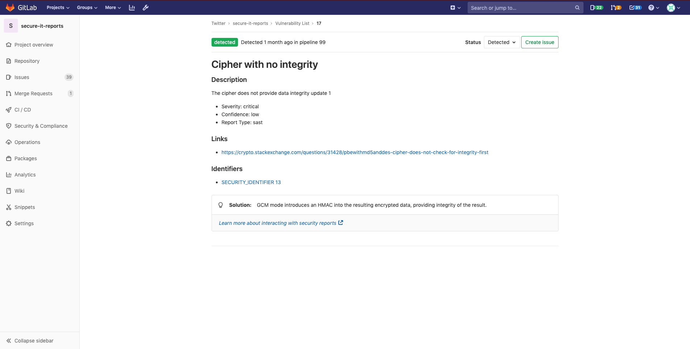
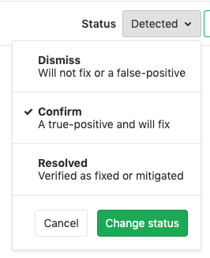

# Standalone Vulnerability pages

<!-- TODO: When was this introduced? -->
> [Introduced](https://gitlab.com/gitlab-org/gitlab/issues/13561) in [GitLab Ultimate](https://about.gitlab.com/pricing/) 12.9.

CAUTION: **Warning:**
This feature is currently [Alpha](https://about.gitlab.com/handbook/product/#alpha-beta-ga) and while you can start using it, it may receive important changes in the future.

Each security vulnerability in the [Vulnerability List](./index.md) has its own standalone page.
On this page you can interract with the vulnerabltiy in several different ways.

- [Change the Vulnerability Status](#changing-vulnerability-status): You can change the status of a vulnerability to be either _Detected_, _Confirmed_, _Dismissed_, or _Resolved_.
- [Create issue](#creating-an-issue-for-a-vulnerability): Create a new issue with the title and description prepopulated with information from the vulnerability report. By default, such issues are [confidential](../project/issues/confidential_issues.md).
- [Solution](#solutions-for-vulnerabilities-auto-remediation): For some vulnerabilities, a solution is provided for how to fix the vulnerability.

### Changing vulnerability status

You can switch the status of a vulnerability using the status switcher dropdown at the top of the page.
This can be set to be either _Detected_, _Confirmed_, _Dismissed_, or _Resolved_.

| State | Description |
|-----------|-------------------------------------------------------------------|
| Detected | The default state for a newly discovered vulnerability |
| Confirmed | A user has seen this vulnerability and confirmed it to be real |
| Dismissed | A user has seen this vulnerability and dismissed it |
| Resolved | The vulnerability has been fixed and is no-longer in the codebase |

### Creating an issue for a vulnerability

You can create an issue for a vulnerability by selecting the **Create issue** button at the top of the page.

This creates a [confidential issue](../project/issues/confidential_issues.md) in the project the vulnerability came from, and prepopulates it with some useful information taken from the vulnerability report.
Once the issue is created, you are redirected to it so you can edit, assign, or comment on it.

### Solutions for vulnerabilities (auto-remediation)

Some vulnerabilities can be fixed by applying the solution that GitLab automatically generates.
The following scanners are supported:

- [Dependency Scanning](dependency_scanning/index.md):
  Automatic Patch creation is only available for Node.js projects managed with
  `yarn`.
- [Container Scanning](container_scanning/index.md)

#### Manually applying the suggested patch

Some vulnerabilities can be fixed by applying a patch that is automatically generated by GitLab. To apply the fix:

1. Download and review the patch file `remediation.patch`.
1. Ensure your local project has the same commit checked out that was used to generate the patch.
1. Run `git apply remediation.patch`.
1. Verify and commit the changes to your branch.

