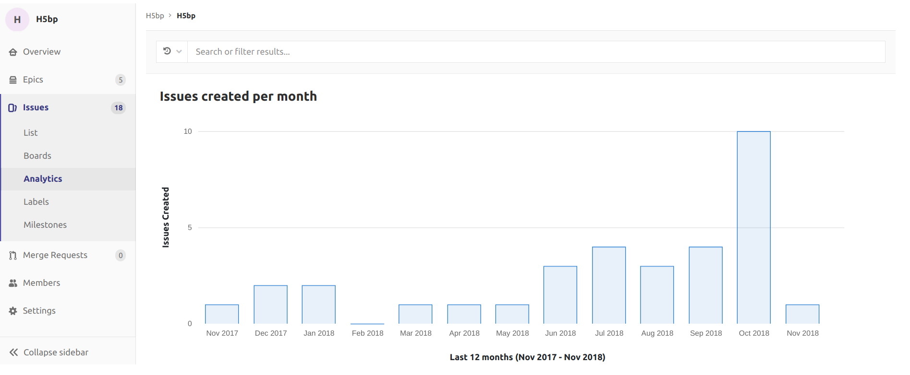

# Issues created per month

> [Introduced](https://gitlab.com/gitlab-org/gitlab-ee/issues/7478) in [GitLab Premium](https://about.gitlab.com/pricing/) 11.5.

GitLab can display a bar chart of the number of issues created each month. By default, GitLab displays the number of all issues created in the last 12 months but this is configurable.

The **Search or filter results...** field can be used for filtering the issues by any attribute. For example, labels, assignee, milestone, and author.

To access the chart, navigate to a group's sidebar and select **Issues > Analytics**.

