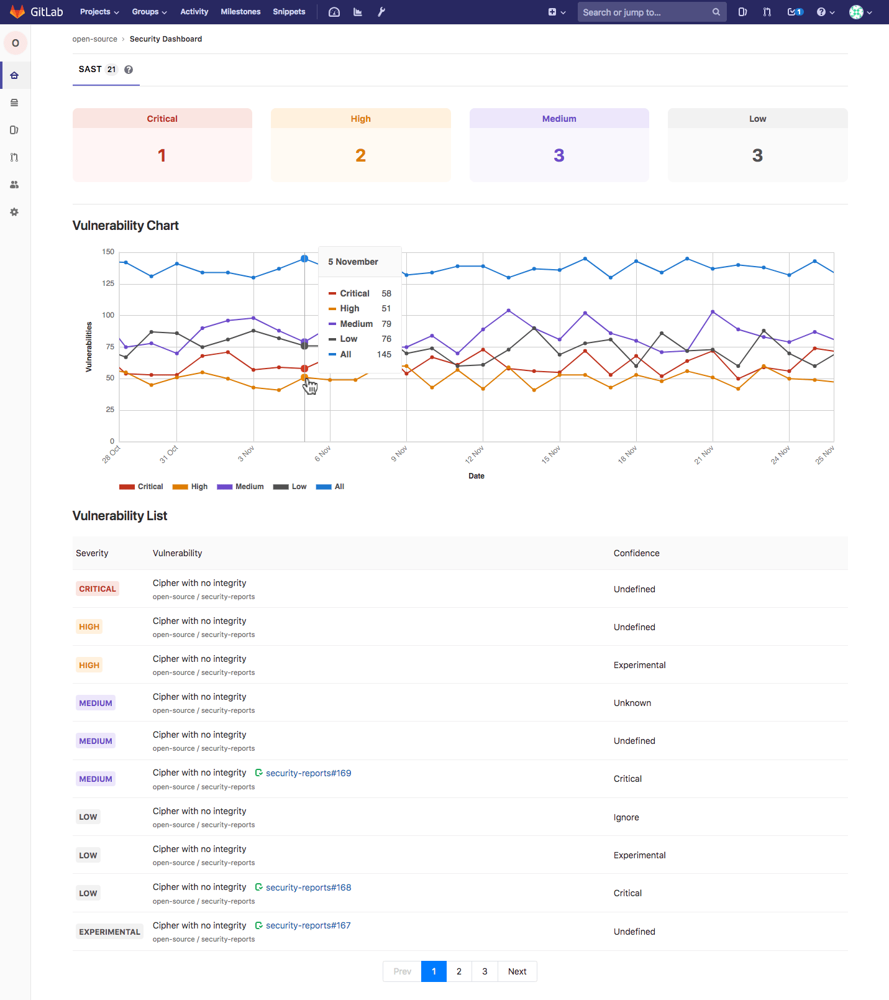
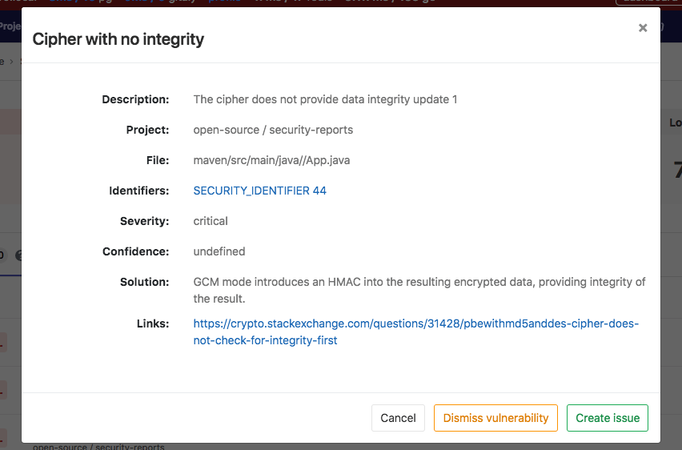
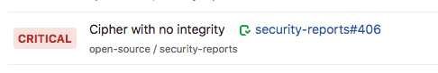

# Group Security Dashboard **[ULTIMATE]**

> [Introduced](https://gitlab.com/gitlab-org/gitlab-ee/issues/6709) in
  [GitLab Ultimate](https://about.gitlab.com/pricing) 11.5.

The Group Security Dashboard gives an overview of the vulnerabilities of all the
projects in a group and its subgroups.

## Overview

To use the Group Security Dashboard, you need a group that has at least one
project with [Static Application Security Testing](../../project/merge_requests/sast.md) or [Dependency Scanning](../../project/merge_requests/dependency_scanning.md)
enabled.

The Dashboard is a good place to get an overview of the security vulnerabilities in your projects.
You can also drill down into a vulnerability and get extra information, see which
project it comes from, the file it's in, and various metadata to help you analyze
the risk. You can also action these vulnerabilities by creating an issue for them, or by dismissing them.

Having your vulnerabilities in GitLab allows you to keep track of them and action them, all in the same application.

## Use cases

You want to measure how secure your projects are without having to look into
each one separately.

## Supported features

The group security dashboard supports [SAST](../../project/merge_requests/sast.md), and [Dependency Scanning](../../project/merge_requests/dependency_scanning.md) reports.

## Requirements

To use the group security dashboard:

1. At least one project inside a group must be configured with
   [Static Application Security Testing](../../project/merge_requests/sast.md), or [Dependency Scanning](../../project/merge_requests/dependency_scanning.md).
2. The configured jobs must use the [new `reports` syntax](../../../ci/yaml/README.md#artifactsreports) (see an [example job](../../../ci/examples/sast.md)).
3. [GitLab Runner](https://docs.gitlab.com/runner/) 11.5 or above must be used to execute the jobs.

## Keeping the dashboard up to date

Vulnerabilities are spotted during CI/CD pipelines, so having up-to-date results
depends on how often security jobs are run.

In order to have the latest results displayed in the dashboard, you can
[schedule a daily pipeline](../../project/pipelines/schedules.md), so reports
are created even if no code change happens.

## Viewing the vulnerabilities

First, navigate to the Security Dashboard found under your group's
**Overview > Security Dashboard**.

Once you're on the dashboard, at the top you should see a series of filters for:

- Severity
- Report type
- Project

Selecting one or more of these will filter
the results in the sectons below. The first section is an overview of all the
vulnerabilities, grouped by severity. Underneath these overviews is a timeline
chart that shows how many open vulnerabilities you had at various points in time.
You can hover over the chart to get more details about the open vulnerabilities
at that time.

Finally, there is a list of all the vulnerabilities in the group, sorted by severity.
In that list, you can see the severity of the vulnerability, its name, its
confidence (likelihood of the vulnerability to be a positive one), and the project
it's from.

If you hover over a row, there will appear some actions you can take:

- "More info"
- "Create issue"
- "Dismiss vulnerability"

### Getting more information for a vulnerability

Clicking the "More info" button opens a modal with more information about the
selected vulnerability where you can get a better description, as well as the
file it came from, and a possible solution. You get access to the
["Dismiss vulnerability"](#dismissing-a-vulnerability) and
["Create issue"](#creating-an-issue-for-a-vulnerability) buttons inside this
modal as well.

### Creating an issue for a vulnerability

You can create an issue for a vulnerability by selecting the "Create issue"
button from the action buttons to the right of a vulnerability row.
This will create an issue on the project this vulnerability came from and pre-fill
it with some useful information.

Once the issue is created, you will be redirected to it so you can edit, assign,
or comment on it. Upon returning to the dashboard you'll see that the vulnerability
will now have an associated issue next to the name.

You can get the same result if you select the **Create issue** button from inside
the "More info" modal.

### Dismissing a vulnerability

You can also dismiss vulnerabilities by clicking the "Dismiss vulnerability" button.
This will dismiss the vulnerability and re-render it to reflect its dismissed state.
If you wish to undo this dismissal, you can click the "Undo dismiss" button.

You can get the same behaviour if you dismiss a vulnerability from within the
"More info" modal.
