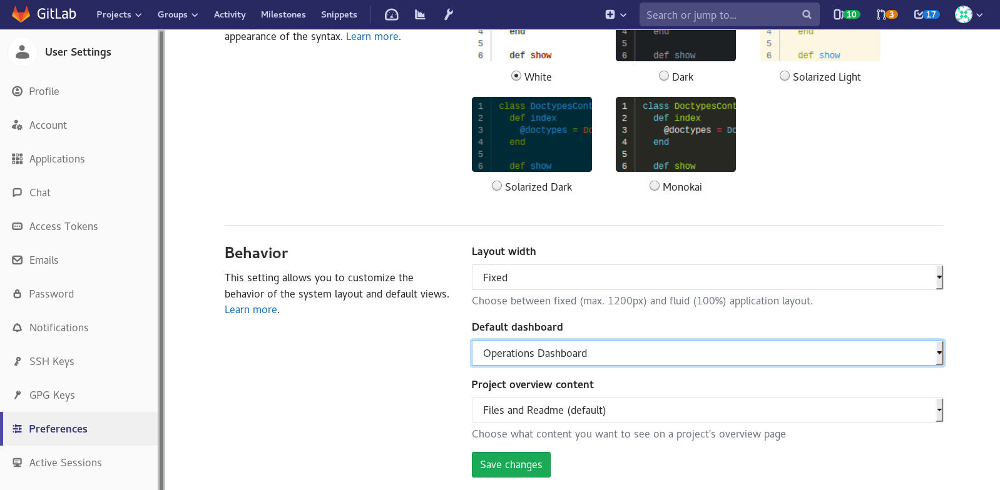
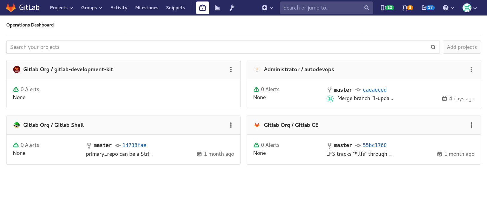

# Operations Dashboard **[ULTIMATE]**

> [Introduced](https://gitlab.com/gitlab-org/gitlab-ee/issues/5781)
in [GitLab Ultimate](https://about.gitlab.com/pricing/) 11.5.

The Operations Dashboard provides a summary of each project's operational health,
including pipeline and alert status.

The dashboard can be accessed via the top bar, by clicking on the new
dashboard icon:

The Operations Dashboard can also be made the default GitLab dashboard shown when
you sign in. To make it the default:

1. Go to **User Settings > Preferences**.
1. In the **Behaviour** section, select **Operations Dashboard** from the **Default dashboard** dropdown.
1. Click the **Save changes** button.

## Adding a project to the dashboard

NOTE: **Note:**
For GitLab.com, projects must belong to a group with a [Gold](https://about.gitlab.com/pricing/)
subscription to be added to the Operations Dashboard.

To add a project to the dashboard:

1. Search for a project using the **Search your projects** field.
1. Click the **Add projects** button.

Once added, the dashboard will display the number of active alerts,
last commit, pipeline status, and when it was last deployed.

