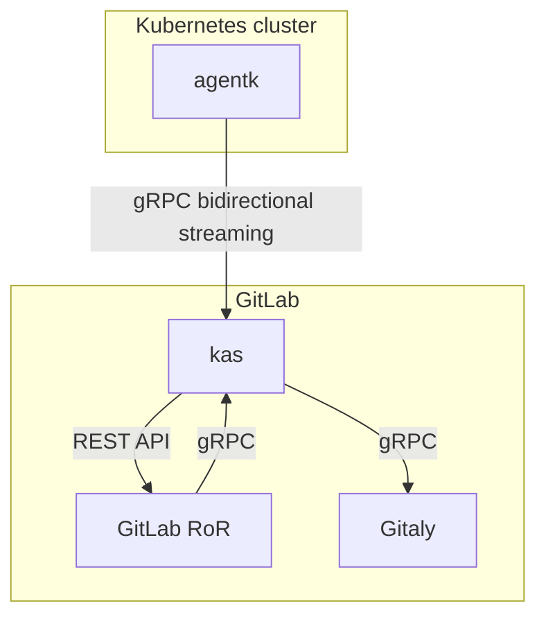

# GitLab-agent architecture

## Issues the agent is trying to address

- In general makes it possible to integrate a cluster behind a firewall or NAT with GitLab. See [Invert the model GitLab.com uses for Kubernetes integration by leveraging long lived reverse tunnels](https://gitlab.com/gitlab-org/gitlab/-/issues/212810).
- Allows for real-time access to API endpoints within a cluster. See this note on [Allow Prometheus in Kubernetes cluster to be installed manually](https://gitlab.com/gitlab-org/gitlab/-/issues/218220#note_348729266) for an example use case.
- Enables real-time features by pushing information about events happening in a cluster. For example, we could build a cluster view dashboard that visualizes changes happening in a cluster immediately, providing a delightful user experience. We already have some effort happening in this area, see [Real-Time Working Group](https://about.gitlab.com/company/team/structure/working-groups/real-time/).
- Makes it possible to have a cache of Kubernetes objects (via [informers](https://github.com/kubernetes/client-go/blob/ccd5becdffb7fd8006e31341baaaacd14db2dcb7/tools/cache/shared_informer.go#L34-L183)) that is kept up to date with very low latency. Having such a cache would be beneficial to:

  - Reduce/eliminate information propagation latency by avoiding Kubernetes API calls and polling and just fetching data from an automatically up to date cache.
  - Lower the load we put on Kubernetes API by removing polling.
  - Eliminate any rate limiting errors by removing polling.
  - Simplify backend code by replacing polling code with cache access (another API call, but no polling needed).

  For example, this note in [Move fetching nodes data out of the cluster model into a lib](https://gitlab.com/gitlab-org/gitlab/-/issues/217792#note_348582537). Instead of fetching data via Kubernetes API we could fetch it from the cache synchronously from the front end.

## High-level architecture

- `agentk` is the GitLab Kubernetes Agent. It keeps a connection established to a `kas` instance, waiting for requests to process. It may also actively send information about things happening in the cluster.

- `kas` is the GitLab Kubernetes Agent Server. It's responsible for:
  - Accepting requests from `agentk`.
  - [Authentication of requests](identity_and_auth.md) from `agentk` by querying `GitLab RoR`.
  - Fetching agent's configuration from a corresponding Git repository by querying Gitaly.
  - Matching incoming requests from `GitLab RoR` with existing connections from the right `agentk`, forwarding requests to it and forwarding responses back.
  - (potentially) Sending notifications via ActionCable for events received from `agentk`.
  - Polling manifest repositories for [GitOps support](gitops.md) by talking to Gitaly.

- `GitLab RoR` is the main GitLab application. It uses gRPC to talk to `kas`. We could also support Kubernetes API to simplify migration of existing code onto this architecture. Could support both, depending on the need.

[Bidirectional streaming](https://grpc.io/docs/guides/concepts/#bidirectional-streaming-rpc) is used between `agentk` and `kas`. This allows the connection acceptor i.e. gRPC server `kas` to act as a client, sending requests as gRPC replies. Inverting client-server relationship is needed because the connection has to be initiated from the inside of the Kubernetes cluster to bypass a firewall or NAT the cluster may be behind. See the issue [Invert the model GitLab.com uses for Kubernetes integration by leveraging long lived reverse tunnels](https://gitlab.com/gitlab-org/gitlab/-/issues/212810).
