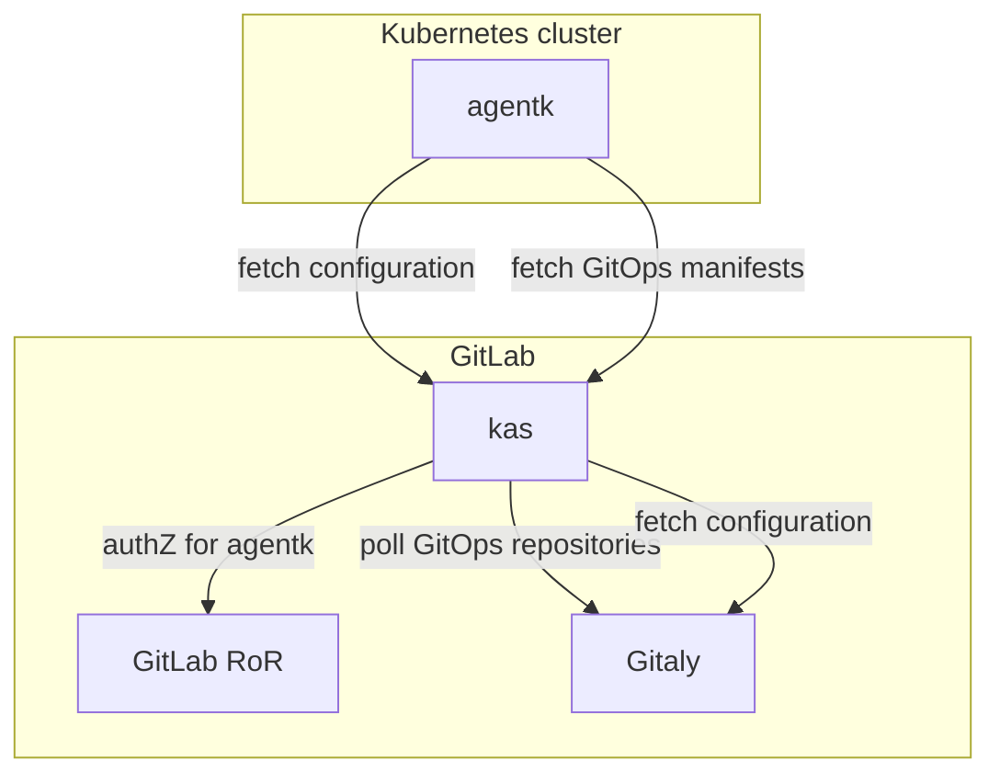

# GitOps support

GitLab Kubernetes Agent offers [GitOps](https://www.gitops.tech/) support. More specifically, the [pull-based version](https://www.gitops.tech/#pull-based-deployments).

## GitOps architecture

`agentk` periodically fetches configuration from `kas`. For each configured GitOps repository it spawns a goroutine. Each goroutine makes a streaming `GetObjectsToSynchronize()` gRPC call. `kas` accepts these requests and checks with GitLab if this particular agent is authorized to access this repository.
If it is, `kas` starts polling Gitaly for repository updates and sends the latest manifests to the agent. Before each poll, `kas` verifies with GitLab that the agent's token is still valid. When `agentk` receives an updated manifest, it performs a synchronization using [`gitops-engine`](https://github.com/argoproj/gitops-engine).

For repositories no longer in the list, `agentk` stops corresponding `GetObjectsToSynchronize()` calls.
