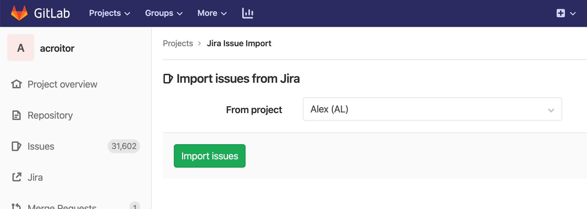
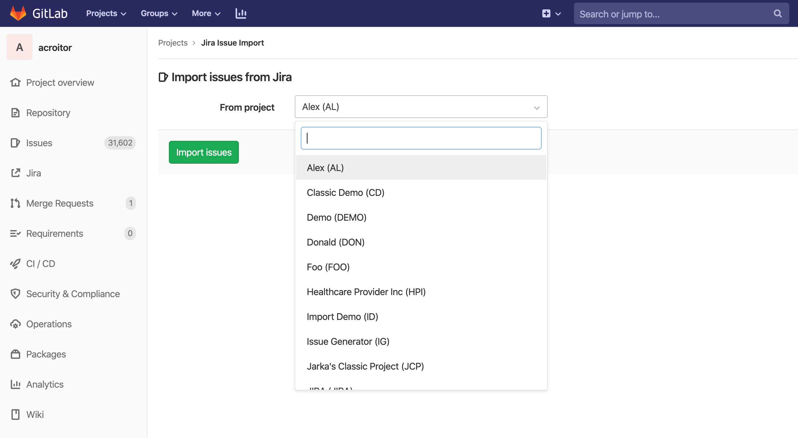

# Import your Jira project issues GitLab

Using the importer, you can import your Jira issues to GitLab.com or to
your self-managed GitLab instance.

## Overview

Jira issues import is a MVC feature introduced in 12.10 as a project level feature, meaning that issues from multiple
Jira projects can be imported into a GitLab project. MVC version imports issue title and descriptio as well as some
other issue metadata as a section in the issue description.

## Prerequisites

### Permissions

In order to be able to import issues from a Jira project users need to have read access on Jira issues as well as
maintainer or owner role in GitLab project that you wish to import into or site admin role.

### Jira Integration

Jira import feature makes use of an existing [Jira integration](../integrations/jira.md) feature within GitLab. Please
esure you have the integration setup before trying to import Jira issues.

## How to import

Jira issues import is being integrated into GitLab issues feature and can be triggered by clicking the `Import Issues` button
and selecting `Import from Jira` option.

Selecting the `Import from Jira` will bring you to the following form.

At this point if you have had the [Jira integration](../integrations/jira.md) setup, you should be able to see the Jira
projects that you have access to in the dropdown and select the Jira project that you wish to import issues from.

Next you click `Import Issues` and you should be presented with a confirmation that import has started. While import is
running in the background you can navigate away from import status page to issues page and should be able to see new issues
poping up in the issues list.

NOTE: **Note:**
While Jira issues import happens in real time, it is done in an asynchroneous background job, which may result in delays
based on import queues load, system load or other factors. Importing large projects may take several minutes depending
on the size of the import, you can check the status by navigating to the Jira import page

