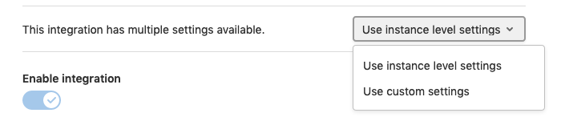

# Instance level integrations

> Introduced in GitLab 13.3.

Instance level integrations allow you to set up [integrations](overview.md) for all projects across your instance.
Updating instance level integrations will update all projects inheriting from that integration.
On a project level the instance level integration can be overwritten, in case you want use different settings or disable
an integration.

<i class="fa fa-youtube-play youtube" aria-hidden="true"></i>
For an introduction to the feature, see [Instance level integrations walk-through](https://youtu.be/bGq-MH--5BE).

## Setting up an instance level integration

1. Navigate to **Admin Area > Settings > Integrations**.
1. Choose the integration that you want to set up for projects on your instance.
1. Fill out the integration details and click "Save changes".

Note: If you set up an instance level integration for the first time, you will set up the same integration for all existing projects that do not have an integration of the same type set up. Projects with an existing integration of the same type are not changed.

## Overwriting an integration on the project level

1. Navigate to **Project > Settings > Integrations**.
1. Choose the integration where you want to overwrite the instance settings.
1. In the dropdown choose: `Use custom settings`

    

1. Fill out the integration details and click "Save changes".

If you want to switch back to your instance level integration settings, please choose `Use instance level settings`

## Caveats

Instance level integrations are just available for users of self-managed instances. We are currently working on enabling this logic on the group level as well, so that users of GitLab.com can also utilize this feature. [link tba]

Currently it is just possible to inherit the complete settings for an integration. Per-field inheritance is planned. [link tba]
