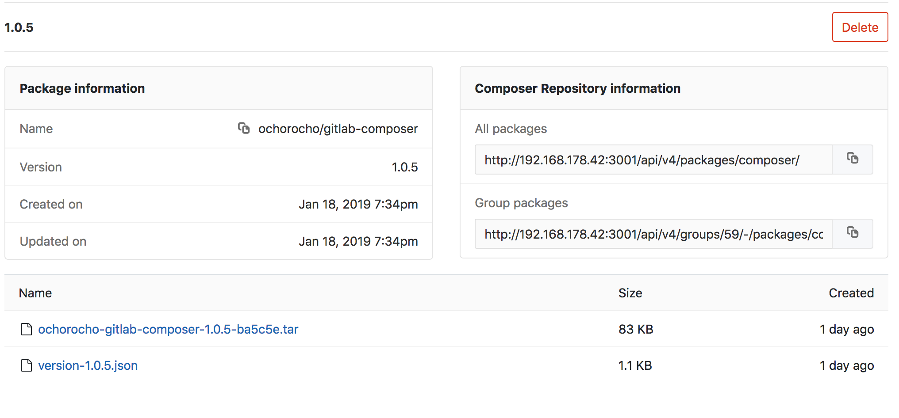

# GitLab Composer Repository **[PREMIUM]**

> [Introduced](https://gitlab.com/gitlab-org/gitlab-ce/issues/22079) in [GitLab Premium](https://about.gitlab.com/pricing/) 11.11.

With the GitLab [Composer](https://getcomposer.org/) Repository, every
project can have its own space to store its Composer packages.



To enable Gitlab Packages see [Enable Maven Repository](../../../administration/packages.md)

## Authenticating to the GitLab Composer Repository

If you're using Composer with GitLab CI/CD, a CI job token ( CI_JOB_TOKEN ) will be used by default but if you prefer to use private token instead simply define it in Settings -> Environment Variables: `PRIVATE_TOKEN`  

You should now be able to upload Composer packages to your project.

## Configuring your project to use the GitLab Composer repository 

To be able to publish packages it was required to extend the composer package generator called [satis](https://github.com/composer/satis/). 
For details see this repository [gitlab-composer](https://github.com/ochorocho/gitlab-composer)

This adds the following commands:

  * `gitlab-composer build-local` : Takes settings json file as argument and `--version-to-dump` as option which can either be a branch or a tag
  * `gitlab-composer publish` : Takes settings json file as argument, will upload all files in the set directory (satis.json -> archive -> absolute-directory)
  * Appending `-vvv` will enable verbose output 

### Add files to the project

General information

* `satis.json` is the file used to configure some parts of the "build". [Satis is](https://github.com/composer/satis) composers package build tool
* `composer.json` is needed for php composer. Each package has to have a `composer.json` for name, dependencies etc.
* `.gitlab-ci.yml` uses a special container which uses `composer` and `satis` together with my addon [gitlab-composer](https://github.com/ochorocho/gitlab-composer) baked in

To build a project you need to add/extend `satis.json` and `.gitlab-ci.yml`.

`satis.json` defines possible options for a build

```json
{
  "config":{
   "secure-http":false // only required if not using https
  },
  "repositories": [
    {
      "type": "vcs",
      "url": "./"
    }
  ],
  "archive": {
    "format": "tar", // possible values: zip, tar
    "absolute-directory": "build" // path where the built files are stored
  }
}
```

In `.gitlab-ci.yml` add a job to build and publish a package

```yaml
image: ochorocho/gitlab-composer:release-1.0.3

build:
  stage: build
  script:
    - /gitlab-composer/gitlab-composer build-local ./satis.json --version-to-dump=$CI_COMMIT_REF_NAME -vvv
    - /gitlab-composer/gitlab-composer publish ./satis.json
```

In case you want to build manually, run these commands (gitlab-composer is required on the build machine)

```bash
gitlab-composer build-local ./satis.json --version-to-dump=1.0.0
gitlab-composer publish ./satis.json
```

### Add `PRIVATE_TOKEN` environment variable

If you use private token authentication add variable `PRIVATE_TOKEN` under Project -> Settings -> CI / CD -> Environment variables

## Endpoints for composer packages

### Push Composer package endpoint

This endpoint is used by the runner to upload packages and the corresponding json file.
This is just for informations sake. You don't need to define this. The runner will figure out the url itself.

```
http://gitlab.com/api/v4/projects/{project_id}/packages/composer/{package/name}
```

Replace `{project_id}` with the project id you want to upload your packages from outside GitlabCI


### Group level Composer endpoint

This endpoint returns all Composer packages of a given group where current user is allowed to:

```
https://gitlab.com/api/v4/group/{group}/-/packages/composer/packages.json
```

Replace `{group}` with the group you want to load your packages from.

### Instance level Composer endpoint

This endpoint returns all Composer packages the current user is allowed to:

```
https://gitlab.com/api/v4/packages/composer/packages.json
```

**Note**: Composers vendor name must match the Gitlab group name, otherwise it won't appear in the registry

### Define composer repository in `composer.json`

Composer has a `composer.json` file in your project and one in `~/.composer/composer.json`

If you want to add a package repository globally use this command (**recommended**):

```bash
composer config --global repositories.gitlab '{"type": "composer", "url": "http://gitlab.com/api/v4/packages/composer/", "options": { "http": { "header": "PRIVATE-TOKEN: YOUR_PRIVATE_TOKEN"}}}'
```

To add the package repository locally use:

```bash
composer config repositories.gitlab '{"type": "composer", "url": "http://gitlab.com/api/v4/packages/composer/", "options": { "http": { "header": "PRIVATE-TOKEN: YOUR_PRIVATE_TOKEN"}}}'
```

:warning: This will add the repository to your projects `composer.json` and your `PRIVATE-TOKEN` will be exposed to others in git!